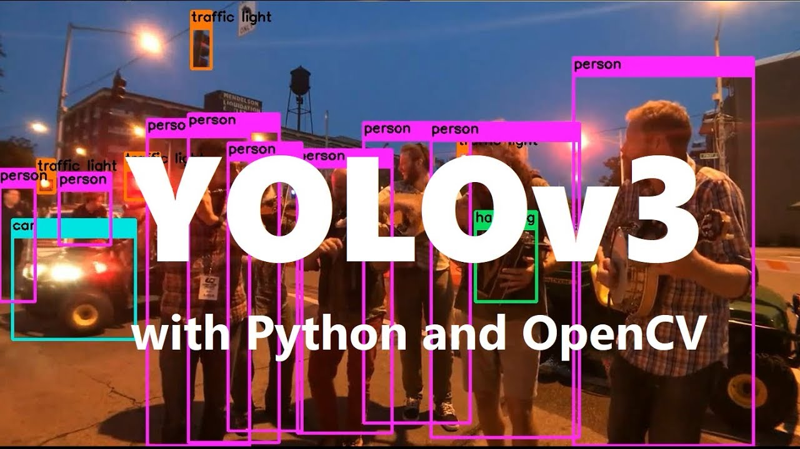
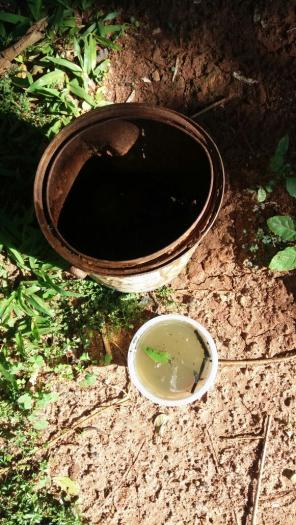
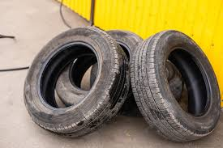
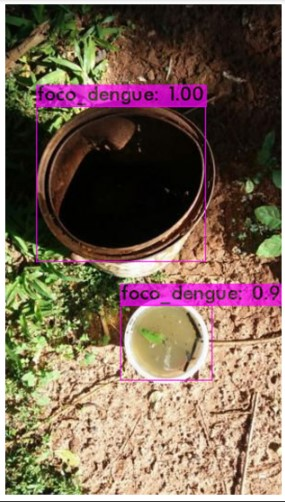
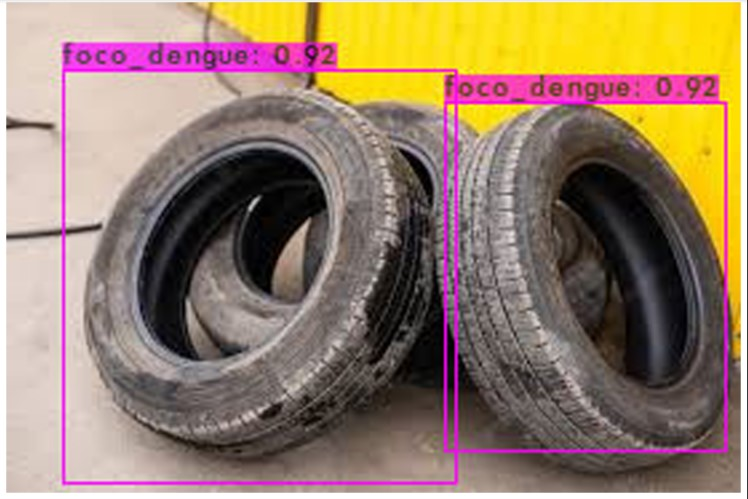

<h1>Detecção com a Rede YoloV3</h1>

Projeto desenvolvido sob o 

    

 

    <h3>Transfer Learning para Detecção de Foco da Dengue</h3>
    
Esse é um projeto de transferência de aprendizado voltado para detecção de água parada ou situações onde o evento pode ocorrer e causar um possível foco de <stronf><i>Aedes Aegypti</i></strong>. O intuíto é o reconhecimento de imagens como a apresentada abaixo, tal como caixas d'aguas abertas, pneus etc.

    
    

 
<h3>Para o treinamento foram seguidos os seguintes passos:</h3>

    <ol>
        <li> Foi criada uma base de dados com 100 imagens de água parada ou de objetos expostos ao ar livre onde existiria a possibilidade de acontecer de ter água parada.</li>
        <li> Com o app <a href="http://labelme.csail.mit.edu/Release3.0/">LabelME</a> foi feita a marcação (bounding boxes) dos objetos a serem detectados e um arquivo foi exportado na pasta "obj" no formato para a rede YOLO (as imagens com os respectivos documentos de texto)</li>
        <li>Optei por utilizar o Google Colab para ter acesso a uma GPU e para facilitar/agilizar o uso da plataforma junto ao Drive compactei a pasta antes de carregar.</li>
        <li>Como se trata de apenas uma classe fiz as alterações necessárias nas configurações da rede YoloV3 nos itens seguintes:</li>
        <ul>
            <li>batch=64</li>
            <li>subdivisions=16</li>
            <li>max_batches = 2000 <i>(2000 * qtde_classes)</i></li>
            <li>steps=1600,1800 <i>(80% e 90% do max_batches)</i></li>
            <li>classes = 1</li>
            <li>filters = 18 <i>- Os filtros também foram alterados seguindo a orientação <strong>(qtde_classe + 5) * 3</strong></i></li>
            <li>random = 0 - Como o acesso à GPU é limitado, também alterei o random para 0 para manter um padrão de tamanho para as imagens e assim economizar memória e rodar o treinamento mais rápido.</li>
        </ul>
        <li> No drive criei uma pasta yolov3 com os seguintes documentos:</li>
        <ul>
            <li>uma pasta backup (para salvar o progresso do treinamento pelo fato do Colab ecerrar a conexão depois de certo período de uso do acesso gratuito à GPU) 
            <li><strong>obj.zip</strong> - pasta com os arquivos JPG e TXT das imagens</li>
            <li><strong>obj.data</strong> - documento com os caminhos para o modelo de treinamento</li>
            <li><strong>obj.names</strong> (nome das classes a serem treinadas)</li>
            <li><strong>yolov3_custom.config</strong> - configuração adaptada para uma classe</li>
            <li><strong>generate.py</strong> - app para gerar o train.txt</li>
             
            
<i>***A pasta backup não foi subida para o Github por conter os mesmos arquivos ja contidos aqui.</i>

        <li>Depois de tudo setado o próximo passo foi baixar o pesos pré-treinados para as camadas convolucionais e iniciar o treinamento com a configuração customizada.</li>
        <li>Por fim, após o treinamento, o detector customizado foi executado.</li>

    
    

